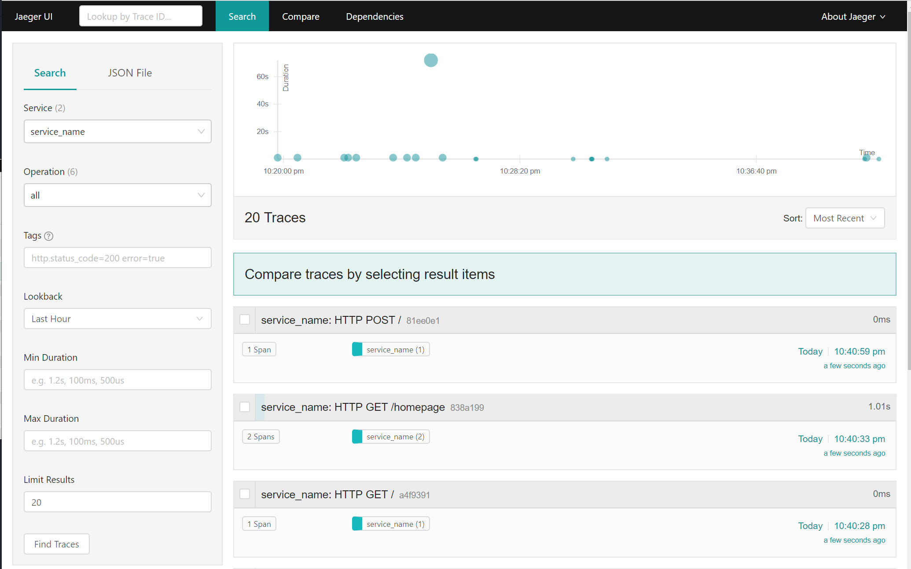
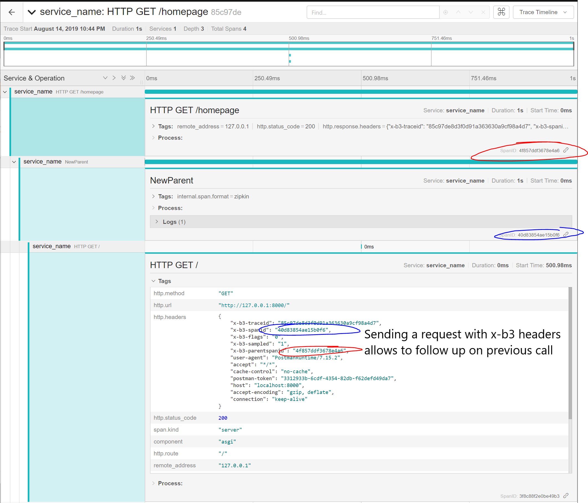

<p align="center"><em>AioZipkin middleware for Starlette</em></p>
<p align="center">
<a href="https://github.com/mchlvl/starlette-zipkin/actions?query=workflow%3ACI" target="_blank">
    
</a>
<a href="https://codecov.io/gh/mchlvl/starlette-zipkin" target="_blank">
    
</a>
<a href="https://pypi.org/project/starlette-zipkin" target="_blank">
    
</a>
</p>

> TODO: test coverage

## Features
- Using [sentry-asgi](https://github.com/encode/sentry-asgi) as a boilerplate
- Client - based on `aiozipkin` - async compatible zipkin library
- Server (any zipkin 2.0 compatible server will work) - Jaeger examples
- Middleware tracing http traffic
- Injecting tracing headers to responses
- Extracting tracing headers from requests
- Context variable with the span for every incoming request - possible to instrument tracing of lower level operations

## Quick start

### Run tracing server 


#### Jaeger all-in-one

Follow instructions at [https://www.jaegertracing.io/docs/1.13/getting-started/](https://www.jaegertracing.io/docs/1.13/getting-started/)

```
$ docker run -d --name jaeger \
  -e COLLECTOR_ZIPKIN_HTTP_PORT=9411 \
  -p 5775:5775/udp \
  -p 6831:6831/udp \
  -p 6832:6832/udp \
  -p 5778:5778 \
  -p 16686:16686 \
  -p 14268:14268 \
  -p 9411:9411 \
  jaegertracing/all-in-one:latest
```

Trace queries at [http://localhost:16686/](http://localhost:16686/)


### Add middleware

```
import uvicorn
from starlette.applications import Starlette
from starlette.responses import JSONResponse
from starlette.routing import Route

from starlette_zipkin import ZipkinMiddleware

routes = [
    Route("/", JSONResponse({"status": "OK"})),
]

app = Starlette(debug=True, routes=routes)

app.add_middleware(ZipkinMiddleware)

if __name__ == "__main__":
    uvicorn.run(app, host="0.0.0.0", port=8000, log_level="info", reload=True)
```

By default the client emits to `http://localhost:9411`.

All traffic is captured and available at [http://localhost:16686/](http://localhost:16686/)



## Advanced Tutorial

To instrument tracing at lower levels, two helper functions are available:

- `get_root_span` - returns the span instance corresponding to current request
- `get_tracer` - returns the tracer instance corresponding to current request

```
import json
import asyncio
import uvicorn
from starlette.applications import Starlette
from starlette.responses import JSONResponse
from starlette.routing import Route

from starlette_zipkin import (
    ZipkinMiddleware,
    ZipkinConfig,
    get_root_span,
    get_tracer,
    B3Headers,
    UberHeaders
)


async def homepage(request):
    root_span = get_root_span()
    tracer = get_tracer()

    with tracer.new_child(root_span.context) as child_span:
        # ! if headers not explicitly provided,\
        # root span from middleware injects headers
        # and becomes the parent for subsequet services
        headers = child_span.context.make_headers()
        child_span.name("NewParent")
        child_span.annotate(
            "Child, sleeps for 1, injects headers and becomes parent"
        )
        await asyncio.sleep(1)
        return JSONResponse({"hello": "world"}, headers=headers)


routes = [
    Route("/", JSONResponse({"status": "OK"})),
    Route("/homepage", homepage),
]

app = Starlette(debug=True, routes=routes)

config = ZipkinConfig(
    host="localhost",
    port=9411,
    service_name="service_name",
    sample_rate=1.0,
    inject_response_headers=True,
    force_new_trace=False,
    json_encoder=json.dumps,
    header_formatter=B3Headers
)
app.add_middleware(ZipkinMiddleware, config=config)

if __name__ == "__main__":
    uvicorn.run(app, host="0.0.0.0", port=8000, log_level="info", reload=True)
```

This way we are able to followup at the call from a different service. Here we use the same server, but pass the tracing headers to subsequent calls to demonstrate future spans:

### Step by step example:

1. client sends

   ```
   GET /homepage HTTP/1.1
   Host: localhost:8000
   User-Agent: PostmanRuntime/7.15.2
   Accept: */*
   Cache-Control: no-cache
   Postman-Token: 519bda7e-bb9c-40c4-a9a5-c8df5524ced2,189c4252-322a-415d-a637-ecdca9a79cb0
   Host: localhost:8000
   Accept-Encoding: gzip, deflate
   Connection: keep-alive
   cache-control: no-cache
   ```

   Server responds

   ```
   X-B3-TraceId: ddfc5b2181e08d3360e4072522c5235a
   X-B3-SpanId: 34dcd9a29c01efe2
   X-B3-Flags: 0
   X-B3-Sampled: 1
   x-b3-parentspanid: b9872416ce86e870

   {"hello":"world"}
   ```

2. client follows up on first trace by passing the context from headers

   ```
   GET /homepage HTTP/1.1
   Host: localhost:8000
   X-B3-TraceId: ddfc5b2181e08d3360e4072522c5235a
   X-B3-SpanId: 34dcd9a29c01efe2
   X-B3-Flags: 0
   X-B3-Sampled: 1
   x-b3-parentspanid: b9872416ce86e870
   User-Agent: PostmanRuntime/7.15.2
   Accept: */*
   Cache-Control: no-cache
   Postman-Token: 2eb6d43a-ed2c-4291-b0c4-c41335e40f6b,bd6376b5-4ab9-45bd-91ab-10f4831547e7
   Host: localhost:8000
   Accept-Encoding: gzip, deflate
   Connection: keep-alive
   cache-control: no-cache
   ```

   Server responds (again with a new set of optional tracing ids)

   ```
   X-B3-TraceId: ddfc5b2181e08d3360e4072522c5235a
   X-B3-SpanId: 3c550de9d7cb62aa
   X-B3-Flags: 0
   X-B3-Sampled: 1
   x-b3-parentspanid: ecb56ce4eba6aed5

   {
   "hello": "world"
   }
   ```

Both calls are collected by Jaeger and available in WebUI



## Configuration

To change the middleware configuration, provide a config object (here with default values being as shown)

```
import json
from starlette_zipkin import ZipkinMiddleware, ZipkinConfig, B3Headers

config = ZipkinConfig(
    host="localhost",
    port=9411,
    service_name="service_name",
    sample_rate=1.0,
    inject_response_headers=True,
    force_new_trace=False,
    json_encoder=json.dumps,
    header_formatter=B3Headers
)

app = Starlette()

app.add_middleware(ZipkinMiddleware, config=config)
```

where:

- `host = "localhost"`
  - default local host, needs to be set to point at the agent that collects traces (e.g. jaeger-agent)
- `port = 9411`
  - default port, needs to be set to point at the agent that collects traces (e.g. jaeger-agent)
  - 9411 is default for zipkin client/agent (and jaeger-agent)
  - make sure to make accessible
- `service_name = "service_name"`
  - name of the service
- `sample_rate = 1.0`
  - zipkin sampling rate, default samples every call
- `inject_response_headers = True`
  - automatically inject response headers
- `force_new_trace = False`
  - if `True`, does not create child traces if incoming request contains tracing headers
- `json_encoder=json.dumps`
  - json encoder can be provided, defaults to json dumps. It is used to format dictionaries for Jaeger UI.
- `header_formatter=B3Headers` 
  - defaults to b3 headers format. Can be switched to UberHeaders, which imply the `uber-trace-id` format.